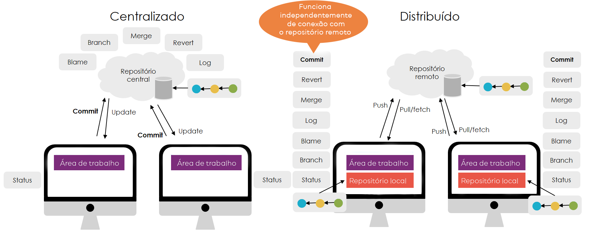

# Iniciando repositório (repo)
Ele cria uma pasta oculta chamada ``.git`` dentro do diretório do seu projeto, onde são armazenadas todas as informações de controle de versão, como histórico de commits e configurações.
Como usar git init
- Criar um novo repositório Git
Abra o terminal e navegue até o diretório do seu projeto:cd /caminho/do/seu/projeto
Em seguida, execute:git init
Isso inicializa um repositório Git no diretório atual.
- Verificar o status do repositório
Após a inicialização, você pode verificar o status do repositório com:git status

- Adicionar arquivos ao repositório
O Git não rastreia automaticamente os arquivos, então você precisa adicioná-los manualmente:git add .

- Criar o primeiro commit
Depois de adicionar os arquivos, salve o estado inicial do projeto com:git commit -m "Primeiro commit"


Configurações adicionais
Se for um repositório compartilhado, você pode inicializá-lo como um repositório "bare" (sem área de trabalho):
git init --bare


Usamos o comando:

```git init```


# Criando um Repositório
Com isso você está iniciando um repositório dessa pasta que digitou git init.
Todos arquivos dentro dessa pasta agora serão reconhecidos pelo Git como um projeto.


# Verificando alterações

```git status```

O Git classifica o estado de cada arquivo em distintas categorias, refletindo se estão sendo rastreados ou não, se sofreram modificações no diretório de trabalho ou se foram incluídos na área de elaboração (staging area), bem como outras situações especiais como renomeações, cópias e conflitos de mesclagem. Para inspecionar essas alterações em qualquer momento, os principais comandos são:

```git status```

(e suas variações abreviadas),

``git diff`` e ``git diff --staged`` , assim como ``git log``, ``git show`` e ``git ls-files`` 


## Estados de Arquivos no Git
1.1. Arquivos Não Rastreáveis (Untracked)
Arquivos não rastreados são aqueles presentes no diretório de trabalho que não fazem parte do último commit nem foram adicionados (git add) à área de preparo 
Git
. Eles são listados em git status sob a seção “Untracked files” e podem ser incluídos ao repositório com git add <arquivo> 
Atlassian
.

1.2 Arquivos Rastreáveis (Tracked)
1.2.1 Não Modificados (Unmodified)
Arquivos não modificados correspondem aos rastreados cujos conteúdos no diretório de trabalho são idênticos aos do último commit 
Git
.

1.2.2 Modificados (Modified)
São arquivos rastreados cujos conteúdos foram alterados desde o último commit, mas ainda não foram adicionados (git add) à área de preparo 
Git
.

1.2.3 Preparados (Staged)
Arquivos preparados são aqueles cujas alterações foram adicionadas à staging area por meio de git add e aguardam confirmação no próximo commit 
Git
.

1.3 Estados Adicionais
Deletado (Deleted): arquivos rastreados removidos do diretório de trabalho e preparados para remoção no commit 
Git
.

Renomeado (Renamed): Git detecta o movimento de um arquivo de um caminho para outro, mostrando R em git status -s quando a opção de detecção de renome está ativa 
Git
.

Copiado (Copied): similar ao renome, mas para cópias explícitas; indicado com C quando status.renames está configurado para “copies” 
Git
.

Não Mesclado (Unmerged): ocorre em conflitos durante merges ou rebases, marcado com U e exigindo resolução manual antes de prosseguir 
Git
.

2. Comandos para Verificação de Alterações
2.1 git status
Exibe o estado do diretório de trabalho e da área de preparo, incluindo se há arquivos “Changes to be committed”, “Changes not staged for commit” e “Untracked files” 
Git
Git
.

A opção -s ou --short apresenta o status de forma abreviada, com códigos de duas letras (XY) indicando índice e árvore de trabalho (por exemplo, M para modificado, ?? para não rastreado, U para não mesclado) 
Tower Git Client
.

2.2 git diff
Sem parâmetros, compara o diretório de trabalho com a área de preparo, mostrando diferenças que ainda não foram adicionadas ao staging 
Graphite.dev
.

Com --staged (ou --cached), compara a área de preparo com o último commit, revelando exatamente o que será incluído no próximo commit 
GitHub
.

2.3 git log e git show
git log exibe o histórico de commits, permitindo filtrar por autor, data, mensagem, arquivos afetados e mais, servindo para investigar quando e por quem as alterações foram realizadas 
Atlassian
.

git show <commit> apresenta detalhes de um commit específico, incluindo metadados e diff das alterações, sendo útil para analisar mudanças pontuais no histórico 
Atlassian
.

2.4 git ls-files
Lista arquivos no repositório conforme o índice, com a opção -t exibindo um prefixo de status (H para content-H, S para staged, R para removed etc.), auxiliando em scripts de inspeção avançada 
Git
.

2.5 Outros Comandos Complementares
git blame <arquivo>: mostra linha a linha qual commit e autor modificaram pelo menos pela última vez cada trecho do arquivo 
Atlassian
.

git clean: remove arquivos não rastreados do diretório de trabalho, útil para “limpar” artefatos temporários 
Graphite.dev
.

git reset --hard HEAD: reverte diretório de trabalho e staging ao estado exato do último commit, descartando modificações locais 
Reddit
.
A combinação desses comandos permite uma visão abrangente do ciclo de vida dos arquivos e do histórico de revisões em um repositório Git 


# Salvando arquivos no repositório 

git commit, git push. 


# Github
git branch -M main


git remote add origin https://github.com/alexsandro-matias/git


git push -u origin main


# Recebendo alterações 

git pull 

sincronização dos arquivos com o servidor remoto seguindo para o servidor local.


# Clonando Repositórios

git clone - link repositorio 

mas se quiser que não crie uma pasta nova, e sim na pasta atual,  git clone - link repositorio **.**


# Acessando Logs

git log


# Revertando arquivos

rollback do arquivo no repositório antes do estado de Modificado

git checkout index.html


# Ignorando arquivos
gitignore


# Resetando arquivos da branch

último commit do repositório remoto
``git reset --hard origin/main``


​O comando git reset é uma ferramenta poderosa no Git, utilizada para desfazer alterações locais e manipular o histórico de commits. Ele opera sobre três áreas principais do repositório: o ponteiro do HEAD (que referencia o commit atual), a área de preparação (index) e o diretório de trabalho (working directory). Dependendo da opção utilizada (--soft, --mixed ou --hard), o git reset afeta essas áreas de maneiras distintas.


# Atalhos 
## Worspace
| Modo     | Head (Histórico) | Index (Staging Area) | Working Directory (Staging Area) |                                                                  Descrição                                                                   |
| :------- | :--------------: | :------------------: | :------------------------------: | :------------------------------------------------------------------------------------------------------------------------------------------: |
| -- soft  |    ✅ Atualiza    |       ❌ Mantém       |             ❌ Mantém             |    Move o ponteiro HEAD para um commit anterior, mantendo as alterações no index e no diretório de trabalho. Ideal para combinar commits.    |
| -- mixed |    ✅ Atualiza    |      ✅ Atualiza      |             ❌ Mantém             | Move o HEAD e atualiza o index para refletir o commit especificado, mas preserva as alterações no diretório de trabalho como não preparadas. |
| -- hard  |    ✅ Atualiza    |      ✅ Atualiza      |            ✅ Atualiza            |  Move o HEAD, atualiza o index e o diretório de trabalho para coincidir com o commit especificado. Todas as alterações locais são perdidas.  |


### Detalhamento das Opções
# ``git reset --soft <commit>``
Comportamento: Move o ponteiro HEAD para o commit especificado, mantendo as alterações no index e no diretório de trabalho.

Uso comum: Quando se deseja desfazer o último commit, mas manter as alterações preparadas para um novo commit.

  git reset --soft HEAD~1
Este comando desfaz o último commit, mantendo as alterações no index.​

1. git reset --mixed <commit> (padrão)
Comportamento: Move o HEAD e atualiza o index para refletir o commit especificado, mas preserva as alterações no diretório de trabalho como não preparadas. Uso comum: Quando se deseja desfazer o último commit e desmarcar as alterações da área de preparação, mantendo-as no diretório de trabalho.

``git reset --mixed HEAD~1`` 

Este comando desfaz o último commit e remove as alterações do index, mas as mantém no diretório de trabalho.​


``git reset --hard <commit> ``

Comportamento: Move o HEAD, atualiza o index e o diretório de trabalho para coincidir com o commit especificado. Todas as alterações locais são perdidas. Uso comum: Quando se deseja descartar completamente as alterações locais e retornar a um estado anterior do repositório.


git reset --hard HEAD~1
Este comando desfaz o último commit e descarta todas as alterações locais.​

### ⚠️ Considerações Importantes
- Perda de Dados: O uso de ``git reset --hard`` é destrutivo. Todas as alterações não comprometidas serão perdidas permanentemente. Utilize com cautela.
- Repositórios Compartilhados: Evite usar git reset em branches compartilhadas, pois isso reescreve o histórico e pode causar conflitos para outros colaboradores.
- Alternativas Seguras: Para desfazer commits sem reescrever o histórico, considere usar git revert, que cria um novo commit que desfaz as alterações do commit anterior.​
gitkraken.com


# Branch
Uma branch no Git representa uma linha independente de desenvolvimento dentro de um repositório. Ela permite que você trabalhe em novas funcionalidades, correções ou experimentações sem afetar diretamente o código principal, geralmente localizado na branch main ou master.​ 




No Git, uma branch é essencialmente um ponteiro para um commit específico. Quando você cria uma nova branch, está criando uma nova linha de desenvolvimento que pode evoluir independentemente das outras. Isso é particularmente útil em ambientes colaborativos, onde diferentes desenvolvedores podem trabalhar simultaneamente em diversas funcionalidades sem interferência mútua.


| Situação                               |                        Sem Git                        |                Com Git (Utilizando Branches)                 |
| :------------------------------------- | :---------------------------------------------------: | :----------------------------------------------------------: |
| Desenvolvimento de nova funcionalidade |    Cópia manual dos arquivos para evitar conflitos    |       Criação de uma nova branch para desenvolvimento        |
| Correção de bugs urgentes              | Dificuldade em isolar e aplicar correções rapidamente | Criação de branch específica para correção e merge posterior |
| Colaboração em equipe                  |  Risco de sobrescrever alterações de outros membros   |          Cada membro trabalha em sua própria branch          |


### 🛠️ Comandos Básicos de Branch no Git
| Comando                          |                     Descrição                     |
| :------------------------------- | :-----------------------------------------------: |
| ``git branch                       ``|          Lista todas as branches locais           |
| ``git branch <nome-da-branch>      ``|   Cria uma nova branch com o nome especificado    |
| ``git checkout <nome-da-branch>    ``|        Alterna para a branch especificada         |
| ``git checkout -b <nome-da-branch> ``|         Cria e alterna para a nova branch         |
| ``git merge <nome-da-branch>       ``|   Mescla a branch especificada na branch atual    |
| ``git branch -d <nome-da-branch>   ``| Deleta a branch especificada (se já foi mesclada) |


Fluxo de Trabalho com Branches
1. Criação de uma nova branch: Para iniciar o desenvolvimento de uma nova funcionalidade ou correção, crie uma nova branch a partir da branch principal.​

```git checkout -b nova-funcionalidade```


2. Desenvolvimento: Realize as alterações necessárias na nova branch.​

3. Commit das alterações: Após concluir as alterações, faça o commit.​

```
git add .
git commit -m "Implementa nova funcionalidade"
```
4. Mesclagem com a branch principal: Após testar e validar as alterações, mescle a nova branch com a branch principal.​

```
git checkout main
git merge nova-funcionalidade
```


5. Deleção da branch: Se a branch não for mais necessária, pode ser deletada.​

``git branch -d nova-funcionalidade``


# 📚 Referências:

