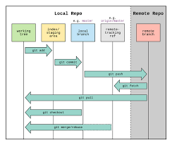
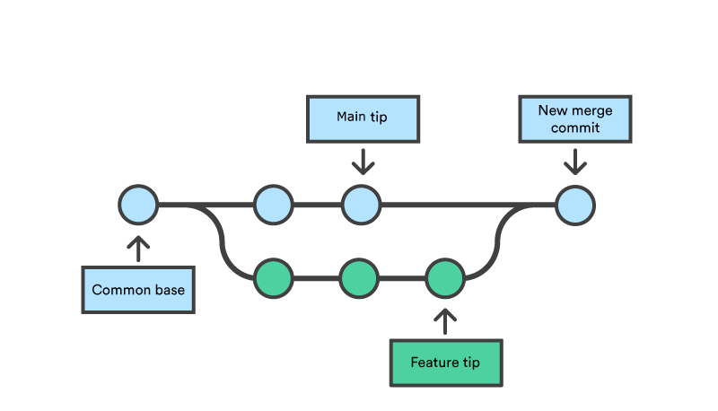
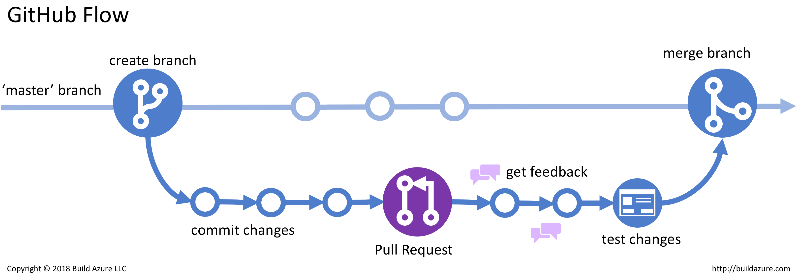
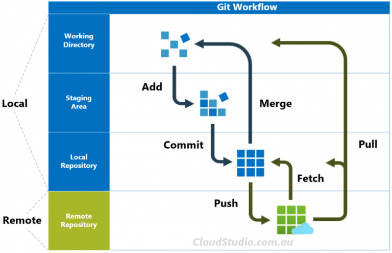
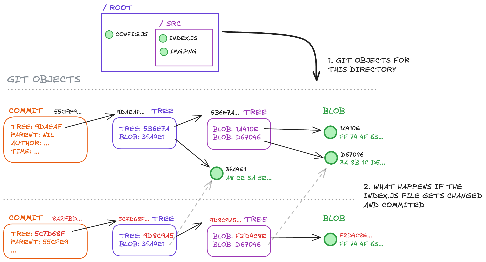

# ÍNDICE


## Índice


- [ÍNDICE](#índice)
  - [Índice](#índice-1)
- [1. INTRODUÇÃO](#1-introdução)
- [CRIANDO UM REPOSITÓRIO](#criando-um-repositório)
- [VERIFICANDO ALTERAÇÕES](#verificando-alterações)
  - [ESTADOS DE ARQUIVOS NO GIT](#estados-de-arquivos-no-git)
- [Salvando arquivos no repositório](#salvando-arquivos-no-repositório)
- [Github](#github)
- [Recebendo alterações](#recebendo-alterações)
- [Clonando Repositórios](#clonando-repositórios)
- [Acessando Logs](#acessando-logs)
- [Revertando arquivos](#revertando-arquivos)
- [Ignorando arquivos](#ignorando-arquivos)
- [Resetando arquivos da branch](#resetando-arquivos-da-branch)
- [Atalhos](#atalhos)
  - [Worspace](#worspace)
    - [Detalhamento das Opções](#detalhamento-das-opções)
- [``git reset --soft <commit>``](#git-reset---soft-commit)
    - [⚠️ Considerações Importantes](#️-considerações-importantes)
- [Branches](#branches)
    - [🛠️ Comandos Básicos de Branch no Git](#️-comandos-básicos-de-branch-no-git)
  - [Mesclando Branches](#mesclando-branches)
  - [🧭 Fluxo de Trabalho com git merge](#-fluxo-de-trabalho-com-git-merge)
  - [🔀 Tipos de Merge](#-tipos-de-merge)
  - [⚠️ Conflitos de Merge](#️-conflitos-de-merge)
- [Uso do git stash](#uso-do-git-stash)
- [Revertando o stash](#revertando-o-stash)
  - [🧰 Comandos Básicos do git stash](#-comandos-básicos-do-git-stash)
  - [🎯 Considerações Importantes:](#-considerações-importantes)
- [Uso de tags](#uso-de-tags)
- [ENCONTRANDO BRANCHES](#encontrando-branches)
  - [🔄 Diferença entre git fetch -a e git pull](#-diferença-entre-git-fetch--a-e-git-pull)
    - [📌 git fetch -a](#-git-fetch--a)
    - [📌 git pull](#-git-pull)
  - [💡 Exemplos Práticos](#-exemplos-práticos)
    - [Exemplo 1: Usando ``git fetch --all``](#exemplo-1-usando-git-fetch---all)
    - [Exemplo 2: Usando git pull](#exemplo-2-usando-git-pull)
  - [✅ Conclusão](#-conclusão)
- [Garbage Collector do Git e como ele melhorara a performance](#garbage-collector-do-git-e-como-ele-melhorara-a-performance)
- [Detalhando o Garbage Collector do Git?](#detalhando-o-garbage-collector-do-git)
  - [Exemplo prático](#exemplo-prático)
  - [Considerações Importantes](#considerações-importantes)
- [GitPages](#gitpages)
- [📚 Referências:](#-referências)


# 1. INTRODUÇÃO
A evolução dos sistemas de controle de versão iniciou-se com ferramentas locais e pré-históricas como o SCCS, passando pelos modelos centralizados de RCS, CVS e SVN nas décadas de 1980 e 1990, até chegar aos sistemas distribuídos (DVCS) a partir dos anos 2000, com projetos como BitKeeper, Mercurial e, sobretudo, Git em 2005 
Wikipedia
teamcoherence.com
. Essa transição refletiu a crescente necessidade de colaboração simultânea, escalabilidade e integridade do histórico de alterações, motivando a migração de arquiteturas cliente-servidor para redes peer-to-peer, onde cada desenvolvedor dispõe de um repositório completo localmente 
teamcoherence.com
Wikipedia
.

1.1 Sistemas de Versionamento Centralizado
Nos Sistemas de Versionamento Centralizado (CVCS), existe um repositório único hospedado em um servidor central, ao qual todos os clientes se conectam para obter (checkout) e enviar (commit) alterações 
Wikipedia
.

Arquitetura Cliente-Servidor: o servidor mantém o histórico completo, enquanto os clientes trabalham em cópias de trabalho locais 
Wikipedia
.

Controle de Acesso: impõe bloqueios ou mecanismos de concorrência para evitar alterações simultâneas no mesmo arquivo.

Exemplos Históricos: além do SVN e CVS, precursores como o SCCS surgiram nos anos 1970, influenciando o desenvolvimento do RCS na década de 1980 
initialcommit.com
.

1.2 Surgimento dos Sistemas Distribuídos
Os Sistemas de Versionamento Distribuído (DVCS) eliminam o ponto único de falha ao permitir que cada clone contenha todo o histórico do projeto, proporcionando operações locais rápidas e maior flexibilidade no fluxo de trabalho 
Wikipedia
.

BitKeeper (2000): um dos primeiros DVCS amplamente usados, adotado pelo kernel Linux até 2005; sua fase gratuita foi descontinuada em julho de 2005, o que motivou o desenvolvimento de alternativas livres 
Wikipedia
.

Mercurial (abril/2005): criado por Matt (agora Olivia) Mackall como substituto do BitKeeper, focado em desempenho, simplicidade e extensibilidade 
Wikipedia
.

Git (abril/2005): idealizado por Linus Torvalds para o kernel Linux, projetado para alta velocidade, robustez em merges e descentralização total 
blog.tarynmcmillan.com
.


#INICIANDO REPOSITÓRIO
Ele cria uma pasta oculta chamada ``.git`` dentro do diretório do seu projeto, onde são armazenadas todas as informações de controle de versão, como histórico de commits e configurações.
Como usar git init
- Criar um novo repositório Git
Abra o terminal e navegue até o diretório do seu projeto:cd /caminho/do/seu/projeto
Em seguida, execute:git init
Isso inicializa um repositório Git no diretório atual.
- Verificar o status do repositório
Após a inicialização, você pode verificar o status do repositório com:git status

- Adicionar arquivos ao repositório
O Git não rastreia automaticamente os arquivos, então você precisa adicioná-los manualmente:git add .

- Criar o primeiro commit
Depois de adicionar os arquivos, salve o estado inicial do projeto com:git commit -m "Primeiro commit"


Configurações adicionais
Se for um repositório compartilhado, você pode inicializá-lo como um repositório "bare" (sem área de trabalho):
git init --bare


Usamos o comando:

```git init```


# CRIANDO UM REPOSITÓRIO
Com isso você está iniciando um repositório dessa pasta que digitou git init.
Todos arquivos dentro dessa pasta agora serão reconhecidos pelo Git como um projeto.


# VERIFICANDO ALTERAÇÕES

```bash
git status
```

O Git classifica o estado de cada arquivo em distintas categorias, refletindo se estão sendo rastreados ou não, se sofreram modificações no diretório de trabalho ou se foram incluídos na área de elaboração (staging area), bem como outras situações especiais como renomeações, cópias e conflitos de mesclagem. Para inspecionar essas alterações em qualquer momento, os principais comandos são:

```git status```

(e suas variações abreviadas),

``git diff`` e ``git diff --staged`` , assim como ``git log``, ``git show`` e ``git ls-files`` 


## ESTADOS DE ARQUIVOS NO GIT
1.1. Arquivos Não Rastreáveis (Untracked)
Arquivos não rastreados são aqueles presentes no diretório de trabalho que não fazem parte do último commit nem foram adicionados (git add) à área de preparo 
Git
. Eles são listados em git status sob a seção “Untracked files” e podem ser incluídos ao repositório com git add <arquivo> 
Atlassian
.

1.2 Arquivos Rastreáveis (Tracked)
1.2.1 Não Modificados (Unmodified)
Arquivos não modificados correspondem aos rastreados cujos conteúdos no diretório de trabalho são idênticos aos do último commit 
Git
.

1.2.2 Modificados (Modified)
São arquivos rastreados cujos conteúdos foram alterados desde o último commit, mas ainda não foram adicionados (git add) à área de preparo 
Git
.

1.2.3 Preparados (Staged)
Arquivos preparados são aqueles cujas alterações foram adicionadas à staging area por meio de git add e aguardam confirmação no próximo commit 
Git
.

1.3 Estados Adicionais
Deletado (Deleted): arquivos rastreados removidos do diretório de trabalho e preparados para remoção no commit 
Git
.

Renomeado (Renamed): Git detecta o movimento de um arquivo de um caminho para outro, mostrando R em git status -s quando a opção de detecção de renome está ativa 
Git
.

Copiado (Copied): similar ao renome, mas para cópias explícitas; indicado com C quando status.renames está configurado para “copies” 
Git
.

Não Mesclado (Unmerged): ocorre em conflitos durante merges ou rebases, marcado com U e exigindo resolução manual antes de prosseguir 
Git
.

2. Comandos para Verificação de Alterações
2.1 git status
Exibe o estado do diretório de trabalho e da área de preparo, incluindo se há arquivos “Changes to be committed”, “Changes not staged for commit” e “Untracked files” 
Git
Git
.

A opção -s ou --short apresenta o status de forma abreviada, com códigos de duas letras (XY) indicando índice e árvore de trabalho (por exemplo, M para modificado, ?? para não rastreado, U para não mesclado) 
Tower Git Client
.

2.2 git diff
Sem parâmetros, compara o diretório de trabalho com a área de preparo, mostrando diferenças que ainda não foram adicionadas ao staging 
Graphite.dev
.

Com --staged (ou --cached), compara a área de preparo com o último commit, revelando exatamente o que será incluído no próximo commit 
GitHub
.

2.3 git log e git show
git log exibe o histórico de commits, permitindo filtrar por autor, data, mensagem, arquivos afetados e mais, servindo para investigar quando e por quem as alterações foram realizadas 
Atlassian
.

git show <commit> apresenta detalhes de um commit específico, incluindo metadados e diff das alterações, sendo útil para analisar mudanças pontuais no histórico 
Atlassian
.

2.4 git ls-files
Lista arquivos no repositório conforme o índice, com a opção -t exibindo um prefixo de status (H para content-H, S para staged, R para removed etc.), auxiliando em scripts de inspeção avançada 
Git
.

2.5 Outros Comandos Complementares
git blame <arquivo>: mostra linha a linha qual commit e autor modificaram pelo menos pela última vez cada trecho do arquivo 
Atlassian
.

git clean: remove arquivos não rastreados do diretório de trabalho, útil para “limpar” artefatos temporários 
Graphite.dev
.

>git reset --hard HEAD: reverte diretório de trabalho e staging ao estado exato do último commit, descartando modificações locais. A combinação desses comandos permite uma visão abrangente do ciclo de vida dos arquivos e do histórico de revisões em um repositório Git 


# Salvando arquivos no repositório 

git commit, git push. 


# Github
git branch -M main


git remote add origin https://github.com/alexsandro-matias/git


git push -u origin main


# Recebendo alterações 

git pull 

sincronização dos arquivos com o servidor remoto seguindo para o servidor local.


# Clonando Repositórios

git clone - link repositorio 

mas se quiser que não crie uma pasta nova, e sim na pasta atual,  git clone - link repositorio **.**


# Acessando Logs

git log


# Revertando arquivos

rollback do arquivo no repositório antes do estado de Modificado

git checkout index.html


# Ignorando arquivos
gitignore


# Resetando arquivos da branch

último commit do repositório remoto
``git reset --hard origin/main``


​O comando git reset é uma ferramenta poderosa no Git, utilizada para desfazer alterações locais e manipular o histórico de commits. Ele opera sobre três áreas principais do repositório: o ponteiro do HEAD (que referencia o commit atual), a área de preparação (index) e o diretório de trabalho (working directory). Dependendo da opção utilizada (--soft, --mixed ou --hard), o git reset afeta essas áreas de maneiras distintas.


# Atalhos 
## Worspace
| Modo     | Head (Histórico) | Index (Staging Area) | Working Directory (Staging Area) |                                                                  Descrição                                                                   |
| :------- | :--------------: | :------------------: | :------------------------------: | :------------------------------------------------------------------------------------------------------------------------------------------: |
| -- soft  |    ✅ Atualiza    |       ❌ Mantém       |             ❌ Mantém             |    Move o ponteiro HEAD para um commit anterior, mantendo as alterações no index e no diretório de trabalho. Ideal para combinar commits.    |
| -- mixed |    ✅ Atualiza    |      ✅ Atualiza      |             ❌ Mantém             | Move o HEAD e atualiza o index para refletir o commit especificado, mas preserva as alterações no diretório de trabalho como não preparadas. |
| -- hard  |    ✅ Atualiza    |      ✅ Atualiza      |            ✅ Atualiza            |  Move o HEAD, atualiza o index e o diretório de trabalho para coincidir com o commit especificado. Todas as alterações locais são perdidas.  |


### Detalhamento das Opções
# ``git reset --soft <commit>``
Comportamento: Move o ponteiro HEAD para o commit especificado, mantendo as alterações no index e no diretório de trabalho.

Uso comum: Quando se deseja desfazer o último commit, mas manter as alterações preparadas para um novo commit.

  git reset --soft HEAD~1
Este comando desfaz o último commit, mantendo as alterações no index.​

1. git reset --mixed <commit> (padrão)
Comportamento: Move o HEAD e atualiza o index para refletir o commit especificado, mas preserva as alterações no diretório de trabalho como não preparadas. Uso comum: Quando se deseja desfazer o último commit e desmarcar as alterações da área de preparação, mantendo-as no diretório de trabalho.

``git reset --mixed HEAD~1`` 

Este comando desfaz o último commit e remove as alterações do index, mas as mantém no diretório de trabalho.​


``git reset --hard <commit> ``

Comportamento: Move o HEAD, atualiza o index e o diretório de trabalho para coincidir com o commit especificado. Todas as alterações locais são perdidas. Uso comum: Quando se deseja descartar completamente as alterações locais e retornar a um estado anterior do repositório.


git reset --hard HEAD~1
Este comando desfaz o último commit e descarta todas as alterações locais.​

### ⚠️ Considerações Importantes
- Perda de Dados: O uso de ``git reset --hard`` é destrutivo. Todas as alterações não comprometidas serão perdidas permanentemente. Utilize com cautela.
- Repositórios Compartilhados: Evite usar git reset em branches compartilhadas, pois isso reescreve o histórico e pode causar conflitos para outros colaboradores.
- Alternativas Seguras: Para desfazer commits sem reescrever o histórico, considere usar git revert, que cria um novo commit que desfaz as alterações do commit anterior.​
gitkraken.com


# Branches
Uma branch no Git representa uma linha independente de desenvolvimento dentro de um repositório. Ela permite que você trabalhe em novas funcionalidades, correções ou experimentações sem afetar diretamente o código principal, geralmente localizado na branch main ou master.​ 




No Git, uma branch é essencialmente um ponteiro para um commit específico. Quando você cria uma nova branch, está criando uma nova linha de desenvolvimento que pode evoluir independentemente das outras. Isso é particularmente útil em ambientes colaborativos, onde diferentes desenvolvedores podem trabalhar simultaneamente em diversas funcionalidades sem interferência mútua.


| Situação                               |                        Sem Git                        |                Com Git (Utilizando Branches)                 |
| :------------------------------------- | :---------------------------------------------------: | :----------------------------------------------------------: |
| Desenvolvimento de nova funcionalidade |    Cópia manual dos arquivos para evitar conflitos    |       Criação de uma nova branch para desenvolvimento        |
| Correção de bugs urgentes              | Dificuldade em isolar e aplicar correções rapidamente | Criação de branch específica para correção e merge posterior |
| Colaboração em equipe                  |  Risco de sobrescrever alterações de outros membros   |          Cada membro trabalha em sua própria branch          |


### 🛠️ Comandos Básicos de Branch no Git
| Comando                               |                     Descrição                     |
| :------------------------------------ | :-----------------------------------------------: |
| ``git branch                       `` |          Lista todas as branches locais           |
| ``git branch <nome-da-branch>      `` |   Cria uma nova branch com o nome especificado    |
| ``git checkout <nome-da-branch>    `` |        Alterna para a branch especificada         |
| ``git checkout -b <nome-da-branch> `` |         Cria e alterna para a nova branch         |
| ``git merge <nome-da-branch>       `` |   Mescla a branch especificada na branch atual    |
| ``git branch -d <nome-da-branch>   `` | Deleta a branch especificada (se já foi mesclada) |


Fluxo de Trabalho com Branches
1. Criação de uma nova branch: Para iniciar o desenvolvimento de uma nova funcionalidade ou correção, crie uma nova branch a partir da branch principal.​

```git checkout -b nova-funcionalidade```


2. Desenvolvimento: Realize as alterações necessárias na nova branch.​

3. Commit das alterações: Após concluir as alterações, faça o commit.​

```
git add .
git commit -m "Implementa nova funcionalidade"
```
4. Mesclagem com a branch principal: Após testar e validar as alterações, mescle a nova branch com a branch principal.​

```
git checkout main
git merge nova-funcionalidade
```


5. Deleção da branch: Se a branch não for mais necessária, pode ser deletada.​

``git branch -d nova-funcionalidade``


## Mesclando Branches
git merge 


​O comando git merge é uma ferramenta fundamental no Git, utilizada para integrar alterações de diferentes branches em uma única linha de desenvolvimento. Esse processo é essencial para consolidar o trabalho de múltiplos desenvolvedores ou para incorporar funcionalidades desenvolvidas separadamente.​

## 🧭 Fluxo de Trabalho com git merge

1. Criar e alternar para uma nova branch de funcionalidade:

```git checkout -b nova-funcionalidade```

2. Desenvolver a funcionalidade e realizar commits:
```
git add .
git commit -m "Implementa nova funcionalidade"
```

3. Alternar de volta para a branch principal (main):
   
```git checkout main```


4. Mesclar a branch de funcionalidade na branch principal:

```git merge nova-funcionalidade```


5. Resolver conflitos, se houver, e finalizar o merge:
```
# Editar os arquivos com conflitos
git add arquivos_resolvidos
git commit
```





Dependendo das funcionalidades é necessária a permissão ma mescla dessa funcionalidade nova com branch principal. Por isso, um exemplo mais completo desse fluxo de mescla de ramificações é o abaixo:



## 🔀 Tipos de Merge
O Git suporta diferentes estratégias de merge, dependendo do histórico das branches envolvidas:​

- Fast-forward: Ocorre quando a branch atual não possui commits adicionais desde que a outra branch foi criada. Nesse caso, o ponteiro da branch é simplesmente avançado para o commit mais recente da outra branch.​
  
- Merge com commit de merge: Utilizado quando as branches divergiram. O Git cria um novo commit que une os históricos das duas branches.​


## ⚠️ Conflitos de Merge
Conflitos de merge surgem quando alterações incompatíveis são feitas nas mesmas linhas de um arquivo em diferentes branches. Nesses casos, o Git não consegue mesclar automaticamente e requer intervenção manual para resolver os conflitos.​ Exemplo de passo a passo para resolução de conflito:

1. Identificar os arquivos em conflito:

```git status```

2. Editar os arquivos para resolver os conflitos, removendo as marcações do Git e mantendo o conteúdo desejado.


3. Alternar de volta para a branch principal (main):
   
```git add arquivo_resolvido```


4. Finalizar o merge:​

```git commit```


# Uso do git stash

Buscar a última versão da main e, ao mesmo tempo, ter a possibilidae re retornar para versão em que estou trabalhando. Neste processo, ele cria um ID desse stash referenciando este commit. Para verifcar os stashes criado, usar o comando:

$ git stash list
stash@{0}: WIP on teste: d74fbb5 criando uma ramificação apenas para testes


# Revertando o stash
Para retornar a stash que teremos a certeza que queremos voltar, usaremos justamente o ID da respectiva stash usando o comando ``apply``. 

Para verificar as diferenças entre do stash:

`` git stash show -p 0
``


🧳 Introdução ao git stash
O comando git stash é uma ferramenta poderosa do Git que permite salvar temporariamente alterações não commitadas no seu diretório de trabalho. Isso é especialmente útil quando você precisa alternar rapidamente entre tarefas ou branches sem perder o progresso atual.​

🔄 Fluxo de Trabalho com git stash
Imagine que você está desenvolvendo uma nova funcionalidade na branch feature/nova-funcionalidade, mas precisa interromper esse trabalho para corrigir um bug urgente na branch main. Utilizando o git stash, você pode armazenar temporariamente suas alterações, mudar para a branch principal, corrigir o bug e, posteriormente, retornar ao seu trabalho anterior.​


```

# Verifique o status atual
git status

# Salve as alterações não commitadas
git stash

# Mude para a branch principal
git checkout main

# Corrija o bug e faça o commit
# ...

# Retorne à branch de funcionalidade
git checkout feature/nova-funcionalidade

# Reaplique as alterações stashed
git stash pop

```


## 🧰 Comandos Básicos do git stash

| Comando                  |                        Descrição                        |
| :----------------------- | :-----------------------------------------------------: |
| git stash                | Salva alterações atuais e limpa o diretório de trabalho |
| git stash list           |              Lista todas as stashes salvas              |
| git stash show           |      Mostra as alterações de uma stash específica       |
| git stash apply          |        Reaplica uma stash sem removê-la da lista        |
| git stash pop            |    Reaplica a stash mais recente e a remove da lista    |
| git stash drop stash@{n} |          Remove uma stash específica da lista           |
| git stash clear          |                 Remove todas as stashes                 |
| git stash branch         |    <nome>	Cria uma nova branch a partir de uma stash    |


## 🎯 Considerações Importantes:

- Escopo Local: As stashes são armazenadas localmente e não são compartilhadas com o repositório remoto.​

Untracked Files: Por padrão, git stash não inclui arquivos não rastreados. Para incluí-los, utilize`` git stash -u `` ou ``git stash --include-untracked``.​

- Conflitos: Ao reaplicar uma stash, podem ocorrer conflitos se o estado atual do repositório tiver divergido significativamente desde o momento do stash. Esteja preparado para resolvê-los manualmente.​


# Uso de tags
Utilizada para marcar versões como uma realease ou uma versão disponibilizada com determinada característica - Beta ou versão final.


``git tag -a v1.0 -m "versão do sistema"
``

Uma vez criada a tag, para visualizar o conteúdo (metadados) da tag, usaremos o comando: 

``
git show v1.0 

``

Para alternar entre as tags, usamos o mesmo comando para chavear entre as branches: 

``
git checkout v1.0 

``


para enviar as Tags, usa a mesma lógica de um commit:

``
git push origin v1.0 

``

Já para enviar todas a tags:

```bash

git push origin --tags
```


# ENCONTRANDO BRANCHES

Para verificar se há ou não branches diferenças entre a remota e a local, caso houver, ele sincroniza os dois repositórios:

``` git
git fetch -a
```

## 🔄 Diferença entre git fetch -a e git pull
### 📌 git fetch -a
O comando git fetch é utilizado para buscar atualizações do repositório remoto, atualizando as referências locais das branches remotas. A opção -a não é uma opção válida para o git fetch. Talvez tenha havido uma confusão com git fetch --all, que busca atualizações de todos os remotos configurados.​

Nota: git fetch -a não é um comando válido. O correto seria git fetch --all.​

### 📌 git pull
O comando git pull é uma combinação de dois comandos: git fetch seguido de git merge. Ele busca as atualizações do repositório remoto e as integra automaticamente na branch atual.​
DevSecOps AI Platform

📊 Comparativo entre git fetch --all e git pull


| Aspecto                   |                 ``git fetch --all``                 |                  ``git pull ``                  |
| :------------------------ | :-------------------------------------------------: | :---------------------------------------------: |
| Atualiza branches remotas |                     ✅ Atualiza                      |                   ✅ Atualiza                    |
| Atualiza branch atual     |                      ❌ Mantém                       |                   ✅ Atualiza                    |
| Requer merge manual       |              ✅ Atualiza (Após o fetch)              |           ❌ Mantém (merge automático)           |
| Risco de conflitos        |       ✅ Baixo (merge manual permite controle)       | ⚠️ Médio (merge automático pode gerar conflitos) |
| Uso recomendado           | Quando deseja revisar mudanças antes de integrá-las |  Quando deseja integrar mudanças imediatamente  |


## 💡 Exemplos Práticos
### Exemplo 1: Usando ``git fetch --all``


```bash
# Busca atualizações de todos os remotos configurados
git fetch --all

```

```bash
# Visualiza as diferenças entre a branch local e a remota
git diff origin/main

```


```bash
# Realiza o merge manual das mudanças
git merge origin/main
```


### Exemplo 2: Usando git pull

```bash
# Busca e integra automaticamente as mudanças da branch remota
git pull origin main
```


Resumo:



## ✅ Conclusão
- ``git fetch --all:`` - Ideal para revisar mudanças antes de integrá-las ao seu trabalho. Proporciona maior controle e segurança, especialmente em ambientes colaborativos.​

- ``git pull:`` - Útil para integrar rapidamente as mudanças do repositório remoto. Deve ser usado com cautela, pois o merge automático pode gerar conflitos inesperados.


# Garbage Collector do Git e como ele melhorara a performance


O Garbage Collector do Git (comando git gc) é um utilitário de manutenção que executa tarefas como compactação de objetos, repack e remoção de objetos inalcançáveis para otimizar o repositório e liberar espaço em disco. Ele agrupa objetos soltos em packfiles e exclui aqueles que não estão referenciados por nenhuma branch, tag ou reflog há tempo suficiente (por padrão, 2 semanas).

Embora o ``git gc`` seja invocado automaticamente em operações comuns (como commits, merges e fetches), também pode ser executado manualmente para forçar uma limpeza profunda do repositório.


```bash

git gc
```

#  Detalhando o Garbage Collector do Git?
O Git armazena cada objeto (blobs, trees, commits) em discos usando hashes SHA-1 e, com o uso contínuo, surgem objetos “soltos” e packfiles fragmentados.



O processo de git gc reúne esses objetos soltos em packfiles eficientes e remove aqueles não alcançáveis a partir de referências ativas, evitando que o repositório cresça indefinidamente.


## Exemplo prático

1. Inspecionar objetos soltos antes do GC

```bash
# Exibe estatísticas de objetos soltos e uso de disco.
git count-objects -vH
```

2. Executar coleta completa

```bash
# Força limpeza imediata de objetos inalcançáveis e compactação agressiva
git gc --aggressive --prune=now

```


3. Verificar resultado após GC

```bash
# Confirma redução de objetos soltos e espaço utilizado.
git count-objects -vH
```


| Comando             |                                        Função                                        |                 Opções Principais                 |
| :------------------ | :----------------------------------------------------------------------------------: | :-----------------------------------------------: |
| git gc              | Executa garbage collection padrão: compacta, empacota objetos e remove inalcançáveis |        --auto, --quiet, --prune=<data> Git        |
| git gc --aggressive | Modo mais lento e completo: reavalia heurísticas de packing para máxima compactação  |                      N/A Git                      |
| git prune           |        Remove objetos que não são alcançáveis a partir de qualquer referência        |                --expire=<data> Git                |
| git repack          |     Recria packfiles combinando objetos soltos e existentes numa estrutura única     | -a (todos os objetos), -d (descartar antigos) Git |


## Considerações Importantes
- O git gc não deleta objetos referenciados por branches, tags, reflogs ou refs gerados por git filter-branch.
- Configurações como gc.reflogExpire, gc.pruneExpire e gc.auto permitem ajustar a periodicidade e critérios de coleta.
- Em repositórios grandes, recomenda-se executar git gc --auto periodicamente ou ajustar gc.auto=1000 e gc.autopacklimit=50 para balancear desempenho e manutenção. 


Desta forma, O garbage collector do Git é essencial para manter repositórios limpos e performáticos, agrupando objetos e removendo dados órfãos, seja de forma automática ou manual.


# GitPages

- [GitHub Pages](https://pages.github.com/)


Cria um repositório - alexsandro-matias.github.io


# 📚 Referências:

- [Documentação Oficial do Git](https://git-scm.com/)

- [Tutorial da Atlassian](https://www.atlassian.com/git)

- [Guia Prático do Opensource.com](https://opensource.com/downloads/git-tricks-tips) 
